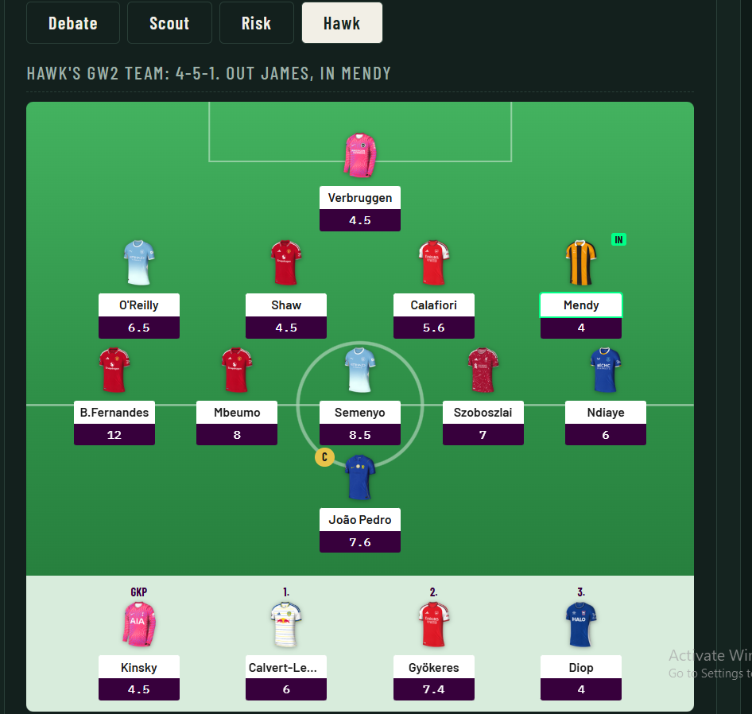

# fpl-committee

[](https://github.com/Mamoro98/fpl-committee/actions/workflows/ci.yml)

Three AI agents manage my Fantasy Premier League team with me. Each gameweek they debate one transfer, attack each other's arguments, and hand me their separate recommendations. I pick one. Real match points decide who advised well, and reputation follows.



## The committee

| Agent | Model | Angle |
|---|---|---|
| scout | openai/gpt-5-mini | upside, differentials, captaincy ceilings |
| risk | deepseek/deepseek-v3.2 | minutes, injuries, rotation traps |
| hawk | google/gemini-3.7-flash | points per million, budget headroom |

One OpenRouter key drives all three. Models are one line each in `src/committee/agents.py`.

## How a week works

1. `committee memo --gw N` (or the Run debate button on the dashboard). The agents get my real squad, bank, live prices, form, injury news, the next three fixtures with difficulty ratings, last week's debate, and their own private track record. Two rounds: independent positions, then named attacks and final calls.
2. I read the debate and pick one agent. That records the pick.
3. After the matches, `committee settle --gw N` pulls the real points. The picked agent earns `10 + transfer-in points + captain points`.

Reputation is an exponential moving average (`score = 0.85 * score + 0.15 * reward`, everyone starts at 17). Recent form dominates, old luck fades. Agents see the scoreboard and their own history in every debate, and a rule violation (an illegal bench, a captain the team does not own) costs 2.0 reputation, logged with the reason.

## Dashboard

```
committee web
```

http://localhost:8000. Team on an FPL-style pitch with club shirts, standings, the debate thread with attacks, one tab per agent showing the team their advice would produce, an archive of every past debate, and pick and settle buttons. Long debates run as background jobs with a live timer.

There is also a one-off `committee draft` that makes the agents build full 15-man squads under the real rules (budget, positions, club limits), with automatic rule checking.

## Setup

```
pip install -e ".[dev]"
copy .env.example .env    # then fill in:
#   OPENROUTER_API_KEY=sk-or-...
#   FPL_ENTRY_ID=<the number in your FPL points page URL>
```

A weekly debate costs a few cents. Before the season's first gameweek is played, FPL keeps squads private; the dashboard has a paste-your-team form for that window and switches to the live API on its own afterwards.

## Development

```
pytest -v        # everything offline, FPL and LLM calls mocked
ruff check .
```

Deterministic core (ledger, reward math, validation, context building) is plain Python with tests. The LLM sits behind one client class and one retry rule. CI runs lint and tests on every push.

Built as a learning project: TDD, branch and PR discipline, CI, FastAPI. The design notes live in my research vault.
